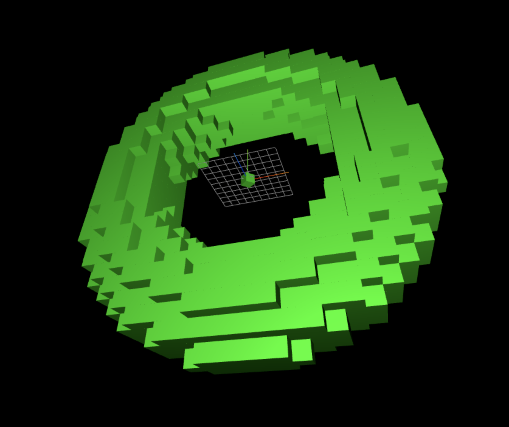
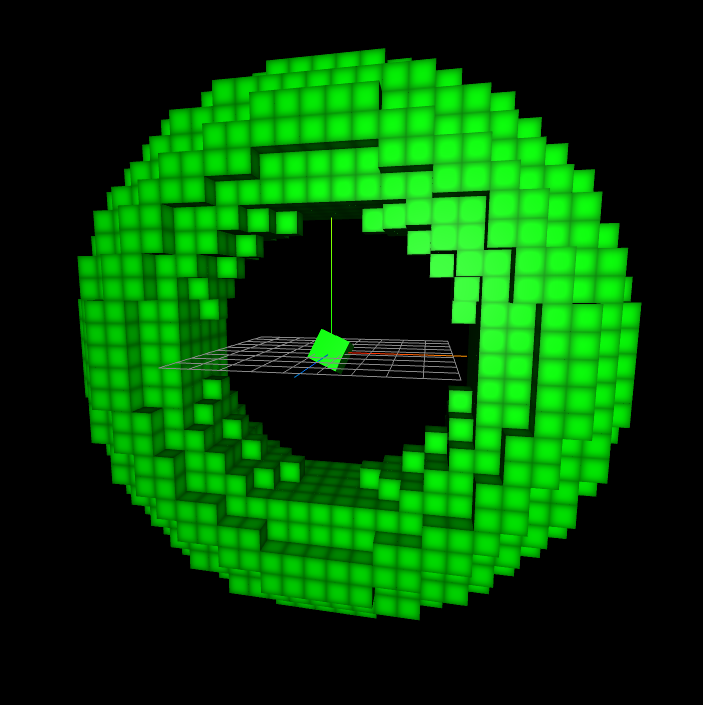
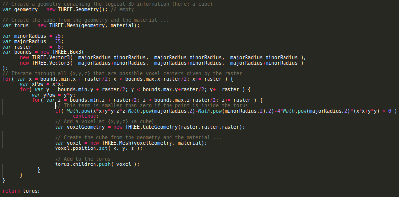

# voxel-torus

This is my 15 minute voxel torus implementation.

I used my threejs basic scene setup which you can find here:
http://www.int2byte.de/public/blog.20160129_Three.js_Basic_Scene_Setup

This implementation uses the wonderful point-in-torus-test I discovered at:
https://stackoverflow.com/questions/13460711/given-origin-and-radii-how-to-find-out-if-px-y-z-is-inside-torus
Thanks to Giles Coope:

```
  From my calculation you must test the sign of the expression
  (x^2+y^2+z^2+a^2-b^2)^2-4a^2(x^2+y^2)
  where the point is {x,y,z} and the minor radius of the torus is b, and the major radius a.
```








Find a live demo here: http://www.int2byte.de/public/voxel-torus/